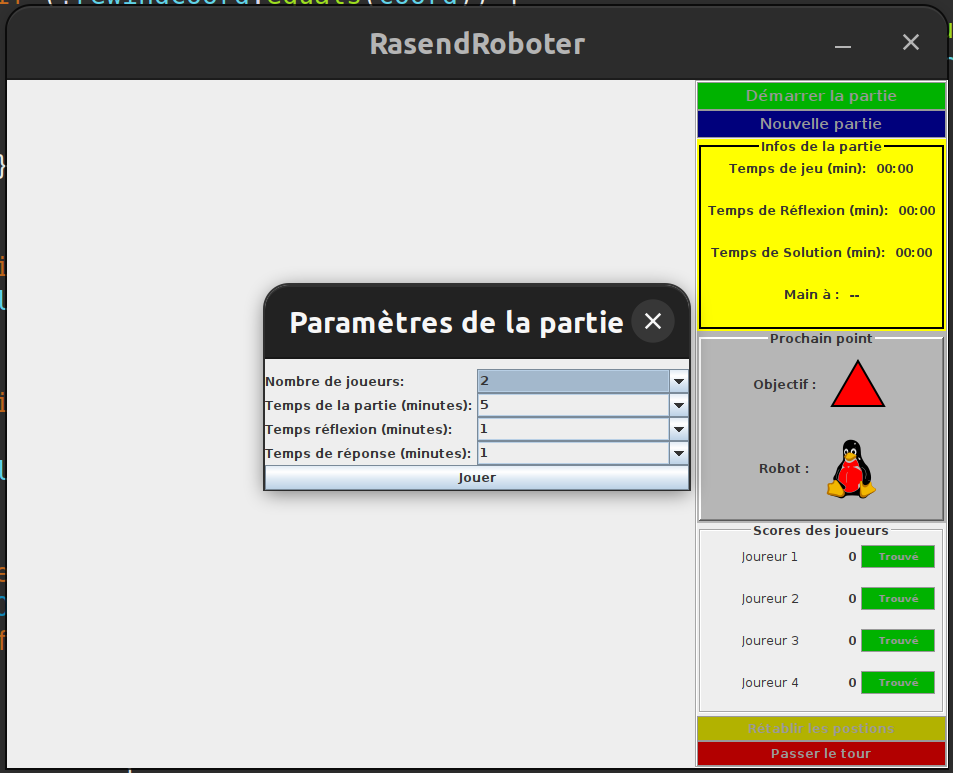
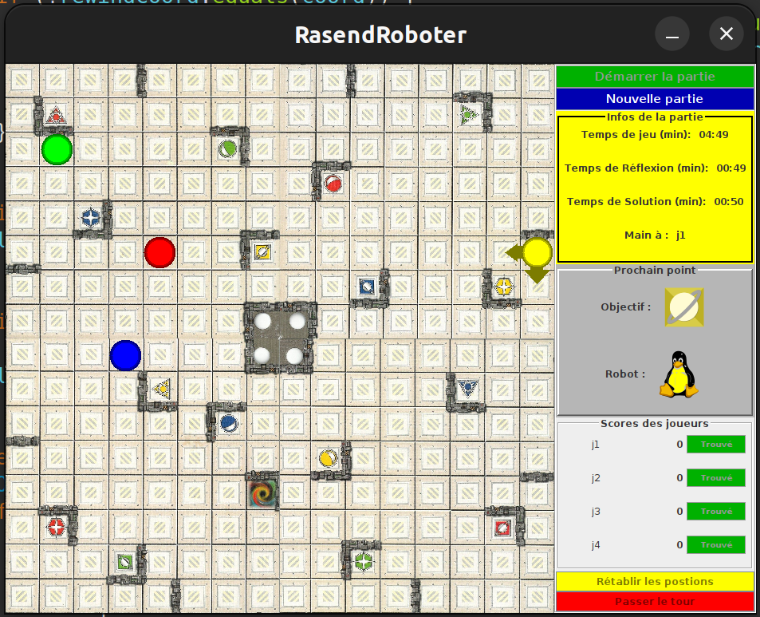

# Rasend Roboter

Il s'agit d'une adaptation du jeu de plateforme de société [Rasend Roboter](https://fr.wikipedia.org/wiki/Ricochet_Robots) développé en Swing Java

## Requirements

Avoir l'environnement java installé

## Utilisation

Vous avez juste à :

* Compiler et exécuter le code depuis votre IDE

* ou générer l'exécutable java et l'exécuter

## Fonctionnement

Pour faire bouger les pions, lorsqu'un joueur aura trouvé une idée de parcours
pour pour atteindre l'objectif fixé avec le pion précisé, ce dernier doit cliqué
sur le bouton **`Trouvé`** à côté de son pseudo. Il peut alors interagir avec
les pions du plateau.

Pour bouger un pion:

* Sélectionner au clique pour l'activer ou le désactivé

* Cliquer dans la direction du mouvement désiré

* Désactivé un bouton actif si on veut en sélectionner un autre

Vous pouvez passer une target lorsqu'aucun joueur n'arrive à trouver de solution
en cliquant sur **`Passer le tour`**

Vous pouvez ramener les pions à leur position initiale en début de tour en
cliquant sur le bouton **`Rétablir les positions`**
